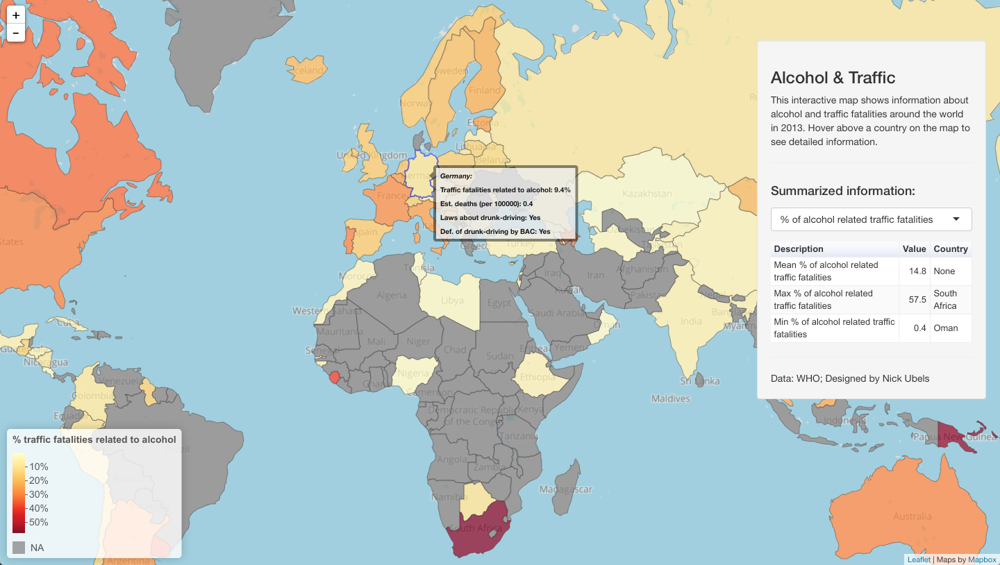

## Traffic & Alcohol RStudio Shiny map

This map is contains four datasets from the WHO on alcohol and traffic. It is made using the Shiny framework in combination with Leaflet and googleVis. The map was made for the University of Groningen course *Research Methods (Data analytics and communication)* (KIB.OZM10).

### Usage
1. Download the files
2. Run the `setup.r` file to fetch all dependencies
3. Rename `EXAMPLE_key.r` to `key.r` and fill in the required fields in the API url. You can also choose to pick a different tiles provider for your baselayer (or use the default OSM)
4. Change the paths on line 15 and 27 of `global.r`
5. Select **Run App** in RStudio

### Used resources
* [Leaflet for R](https://rstudio.github.io/leaflet/)
* [SuperZip example from RStudio Shiny](https://github.com/rstudio/shiny-examples/tree/master/063-superzip-example)
* [Leaflet for R examples](https://github.com/rstudio/leaflet/blob/master/inst/examples/labels.R)
* [World.geo.json](https://github.com/johan/world.geo.json/blob/master/countries.geo.json?short_path=afdfc39) by [johan](https://github.com/johan)
* [First steps of using googleVis on Shiny](http://www.magesblog.com/2013/02/first-steps-of-using-googlevis-on-shiny.html)
